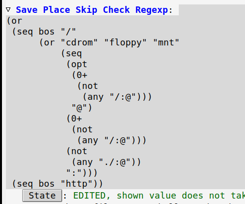

# Table of Contents

1.  [Overview](#orga95fb65)
2.  [Usage](#org1eaccf2)

Edit regexp widgets as rx forms

# Overview

This package lets you edit regexp widgets as rx forms.  The form is passed
directly to the `rx-to-string` function.  It depends on [xr](https://github.com/mattiase/xr) package to convert
regexps to rx forms.

# Usage

Just use `rx-widget` in `:type` argument in `defcustom`

    (defcustom my-custom-var
      "\\(?:some\\)?[long]\\(?:regexp\\)+"
      "My var with regexp"
      :type 'rx-widget
      :group 'my-group)

If you want to use it everywhere, you can override default `regexp` widget.

    (define-widget 'regexp 'rx-widget "A regular expression in rx form.")
